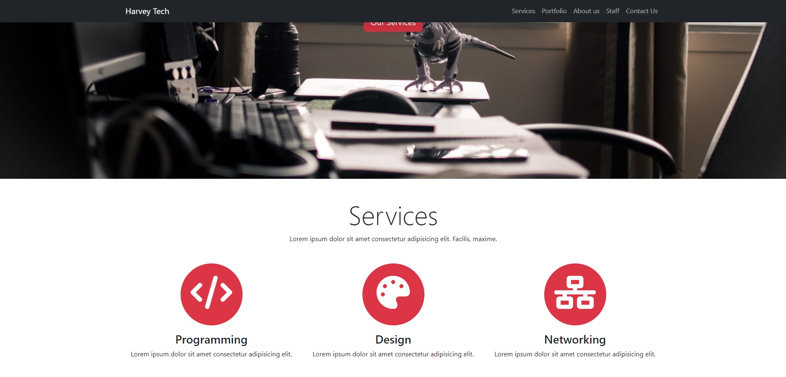

# Harvey Tech Web Page

This project is a web page built using Bootstrap for an IT company called Harvey Tech. The page allows users to access services, portfolio, about, team and contact information.

## Features

- **Navbar:** Navigation menu accessible from anywhere on the page.
- **Banner:** Full-screen overlay banner containing the company's main message.
- **Services:** The section that introduces the services offered by the company.
- **Portfolio:** The section that displays the projects carried out by the company.
- **About Us:** The section that provides information about the company.
- **Our Team:** The section that introduces the team members of the company.
- **Web Clients:** The section that introduces the company's customers or collaborators.
- **Contact Us:** The form through which users can contact.
- **Footer:** Footer containing copyright information.

## Technologies

- **HTML:** Structured content.
- **CSS:** Page design and style.
- **Bootstrap 5:** Responsive design and user interface components.
- **Font Awesome:** Icons.
- **JavaScript:** Bootstrap components for dynamic functionality.

# Harvey Tech Web Page

Bu proje, Harvey Tech adlı bir IT şirketi için Bootstrap kullanılarak oluşturulmuş bir web sayfasıdır. Sayfa, kullanıcıların hizmetler, portföy, hakkında, ekip ve iletişim bilgilerine erişmelerini sağlar.

## Özellikler

- **Navbar:** Sayfanın her yerinden erişilebilen navigasyon menüsü.
- **Banner:** Şirketin ana mesajını içeren tam ekran kaplama banner.
- **Services:** Şirketin sunduğu hizmetleri tanıtan bölüm.
- **Portfolio:** Şirketin gerçekleştirdiği projeleri sergileyen bölüm.
- **About Us:** Şirket hakkında bilgi veren bölüm.
- **Our Team:** Şirketin ekip üyelerini tanıtan bölüm.
- **Web Clients:** Şirketin müşterileri veya işbirlikçilerini tanıtan bölüm.
- **Contact Us:** Kullanıcıların iletişime geçebileceği form.
- **Footer:** Telif hakkı bilgilerini içeren alt bilgi.

## Teknolojiler

- **HTML:** Yapısal içerik.
- **CSS:** Sayfa tasarımı ve stil.
- **Bootstrap 5:** Responsive tasarım ve kullanıcı arayüzü bileşenleri.
- **Font Awesome:** İkonlar.
- **JavaScript:** Dinamik işlevsellik için Bootstrap bileşenleri.

[Canlı Demo'yu Deneyin](https://fatihycan.github.io/Bootstrap-Web-Page/)
